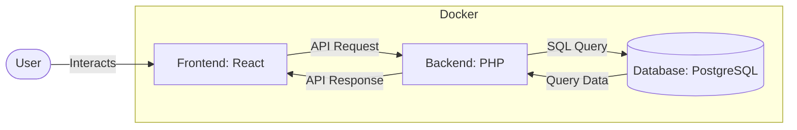

# Personal Expense Tracker (Option #5)

This project is a <strong>Budget Tracking Web App</strong>. It enables user to submit and organize transactions and budgets, to moniter and analyze spending and financial goals. 

## Table Of Contents
- [Structure](#structure)
- [Progress](#progress)
    - [Kanban](https://github.com/users/lduncan1712/projects/1/views/1)
    - [Branches](https://github.com/lduncan1712/CP476/branches)
    - [Contributors](https://github.com/lduncan1712/CP476/graphs/contributors?selectedMetric=commits&all=1)
- [Documentation](#documentation)
    - [Wireframes (./docs/FIGMA.md)](https://www.figma.com/design/5NRWMekE0zTByJyYxOhSXt/CP476-Wireframe?node-id=47-2&t=zqaOV9kuAhYrtkGI-1) 
    - [Wiki (./docs/WIKI.md)](https://github.com/lduncan1712/CP476/blob/main/docs/WIKI.md)
- [Setup](#setup)
    - [Requirements](#requirements)
    - [Instructions](#instructions)

## Structure
This project is a <strong>Local Containerized Web App</strong>, run with <strong>Docker Desktop</strong>.

All utilized languages and tools on this stack are within project description or specifically approved

| Layer     |   Language/Tool | Inclusion |
|-----------|-----------------|------------- |
| Frontend  | React      |  Chapter 11  |
| Backend   | PHP        |  Chapter 12  |
| Database  | PostgreSQL |  Approved    |


## Progress:
Individual tasks were assigned, and their overall progress tracked through a shared  [KANBAN](https://github.com/users/lduncan1712/projects/1/views/1).
Completion of tasks was done through git branches. Only after completion of a task, and following testing and review by anouther member of the group, was the code merged into main.
Correspondingly, the entire contribution history for each group memeber can be found within this repository, and its [BRANCHES](https://github.com/lduncan1712/CP476/branches), as well as a summary agregate for [CONTRIBUTORS](https://github.com/lduncan1712/CP476/graphs/contributors?selectedMetric=commits&all=1)


### Documentation
In addition to code annotation, we documented project discussions and meeting summaries, stored within a [WIKI](./docs/WIKI.MD).
As well as frontend design using [Wireframes](https://www.figma.com/design/5NRWMekE0zTByJyYxOhSXt/CP476-Wireframe?node-id=47-2&t=zqaOV9kuAhYrtkGI-1)


## Setup
### Requirements:
- Docker Desktop (4.6.1+)

### Instructions

1. Create an '.env' file within the project folder, containing the following environment variables. Please note all are local, and can be set to any non blank name
    ```
    POSTGRES_DB=
    POSTGRES_USER=
    POSTGRES_PASSWORD=
    ```
2. Using specified environment variables, run the following command to create the docker container.
    ```
    docker compose up --build
    ```
3. (OPTIONAL): Upon completion of setup, use the below commands/links to confirm each layer of the stack has been properly setup and activated.
    | Layer | Test | Expected |
   |-------|------|----------|
   | Frontend | http://localhost:3000 | Login Page Displayed |
   | Backend  | http://localhost:8080/health.php | Status 200 |
   | Database (Seeded) | ./tests/select_categories.sh | Returns Table Data |
4. To access the application, enter the following credentials into the login page:
   Username: username
   Password: password
